# Bunqy — bunq Hackathon AI Accessibility Assistant

Multimodal AI banking assistant built on the bunq API. Designed for low-vision and accessibility-first users. Combines voice I/O, receipt scanning, RAG-powered help, and guided UI highlighting — all inside a single-page mobile-style interface.

---

## Live Demo & Hosting

This application is deployed for the hackathon using an **AWS EC2 instance** running on a `c7i-flex.large` instance to ensure robust performance for the backend AI operations. 

To provide a secure HTTPS endpoint (which is required for browser APIs like microphone access for voice features), we utilize local tunneling.

🌐 **Live Feature Link:** [https://olive-lemons-burn.loca.lt/](https://olive-lemons-burn.loca.lt/)

*(Note: If the live tunnel is temporarily unavailable, the application can easily be run locally as an alternative, as described in the Quick Start below).*

---

## Architecture Flowchart

```mermaid
flowchart TD
    %% Global Styles
    classDef user fill:#393c6f,stroke:none,color:#fff,rx:10,ry:10
    classDef frontend fill:#1a192b,stroke:#8a8eac,stroke-width:2px,color:#fff,rx:5,ry:5
    classDef process fill:#2d2931,stroke:#c4714b,stroke-width:2px,color:#fff,rx:4px,ry:4px
    classDef ai fill:#2d1b36,stroke:#6b437a,stroke-width:2px,color:#fff
    classDef bunq fill:#172554,stroke:#3b82f6,stroke-width:2px,color:#fff
    classDef db fill:#363121,stroke:#a68a36,stroke-width:2px,color:#fff
    classDef ext fill:#1c1a36,stroke:#4a4282,stroke-width:2px,color:#fff,stroke-dasharray: 5 5

    User(["👤 User (Low Vision / Accessibility First)"]):::user

    subgraph Client ["Frontend (Browser / Mobile)"]
        UI["💻 SPA Interface"]:::frontend
        Voice["🎙️ Voice Input/Output"]:::frontend
        Camera["📷 Receipt Scanner"]:::frontend
    end

    subgraph AWS ["Backend Server (AWS EC2 - c7i-flex.large)"]
        API["⚡ FastAPI Application Hub"]:::process
        
        subgraph AI_RAG ["AI & RAG Subsystem"]
            Agent{"🧠 Core Logic / AI Agent"}:::ai
            Embed["📊 Embeddings Model (BAAI/bge-base)"]:::ai
            VectorDB[("💾 Chroma Vector DB (Help Docs)")]:::db
            
            Agent <-->|"Queries Context"| Embed
            Embed <-->|"Vector Search"| VectorDB
        end
        
        subgraph BunqHub ["Bunq API Wrapper"]
            Auth["🔒 Session Auth"]:::bunq
            Ops{"⚙️ Execute Operation"}:::bunq
            
            Ops -.-> Pay["💸 Send Payment"]:::bunq
            Ops -.-> Split["✂️ Split Bill"]:::bunq
            Ops -.-> Link["🔗 Payment Link"]:::bunq
            Ops -.-> Fetch["📋 Fetch Accounts / Txns"]:::bunq
        end
    end

    subgraph External ["External Services"]
        Anthropic["🤖 Anthropic API (Claude 3.5 Sonnet)"]:::ext
        Groq["👂 Groq Whisper API (STT)"]:::ext
        EdgeTTS["🗣️ Microsoft Edge TTS"]:::ext
        BunqBank(["🏦 bunq Core Banking System"]):::ext
    end

    %% Connections
    User -->|Interacts| Client
    UI -->|HTTP Requests| API
    Voice -->|Audio Stream| Groq
    Camera -->|Image Upload| API
    
    Groq -->|Transcribed Text| API
    API -->|Prompt & Tools| Agent
    
    Agent <-->|Requires Vision/Logic| Anthropic
    Agent -->|Generates Response| EdgeTTS
    EdgeTTS -->|Audio Playback| Voice
    
    Agent -->|Execute Banking Action| Auth
    Auth --> Ops
    Pay & Split & Link & Fetch -->|REST API Calls| BunqBank
    BunqBank -->|JSON Response| Ops
    Ops -->|Data Formatting| Agent

    %% Subgraph Styling
    style Client fill:none,stroke:#8a8eac,stroke-width:2px,stroke-dasharray: 5 5,rx:10,ry:10
    style AWS fill:#221f2e,stroke:#4a4282,stroke-width:2px,rx:10,ry:10
    style External fill:none,stroke:#4a4282,stroke-width:2px,stroke-dasharray: 5 5,rx:10,ry:10
    style AI_RAG fill:#2a1c30,stroke:#6b437a,stroke-width:1px,rx:8,ry:8
    style BunqHub fill:#111b3d,stroke:#3b82f6,stroke-width:1px,rx:8,ry:8
```



---

## Quick Start (Local Setup)

As an alternative to the live link, you can install the dependencies via `requirements.txt` and run the app locally.

```bash
# 1. Install dependencies
pip install -r requirements.txt

# 2. Copy and fill in environment variables
cp .env.example .env

# 3. First-time only: ingest help docs into ChromaDB (~3–5 min, downloads 430MB embedding model)
python rag/ingest.py

# 4. Start server
bash run.sh
```

App runs at `http://localhost:8000`.

---

## Environment Variables

| Variable | Required | Description |
|----------|----------|-------------|
| `ANTHROPIC_API_KEY` | Yes | Claude API key for guide + vision |
| `GROQ_API_KEY` | Yes | Groq Whisper for speech-to-text |
| `BUNQ_API_KEY` | No | bunq sandbox API key (auto-created if absent) |
| `BUNQ_ENVIRONMENT` | No | `SANDBOX` (default) or `PRODUCTION` |
| `SECRET_KEY` | No | Cookie signing key (hardcoded dev default if unset) |

---

## Architecture

```
app.py                    FastAPI — auth, routing, PAGE_ELEMENTS registry
handlers/
  guide.py                Claude tool-use loop → GuideResponse (highlight, steps, actions)
  vision.py               Receipt OCR via claude-sonnet-4-6 vision
  stt.py                  Speech-to-text via Groq Whisper (whisper-large-v3-turbo)
  tts.py                  Text-to-speech via edge-tts (Microsoft en-GB-SoniaNeural, free)
  bunq_api.py             bunq REST wrapper — accounts, transactions, contacts, payments,
                          split bill, payment links, push filters, received requests
rag/
  ingest.py               One-time indexer: chunks all *.md → ChromaDB (BAAI/bge-base-en-v1.5)
  pipeline.py             retrieve(query, k) — BGE embedding → cosine similarity search
frontend/
  index.html              SPA shell — nav, AI widget, push banner, transaction sheet, notif centre
  app.js                  All UI logic: routing, guide, voice I/O, highlight orchestrator,
                          contacts, payment flows, notifications
  style.css               Design system — dark theme, accessibility modes, animations
  login.html              Auth page
bunq_help/                68 markdown help docs (plans, payments, cards, savings, security, features)
banking_domain/           5 markdown docs (SEPA, IBAN, PSD2, AML/KYC, bunq overview)
hackathon_toolkit/        bunq API tutorial scripts + BunqClient wrapper
mock_users.json           10 sandbox test users with API keys
```

---

## Features

### AI Guide (Bunqy)
- Conversational assistant powered by Claude claude-sonnet-4-6 with tool use
- Three response modes:
  - **MODE 0** — Informational: answers questions using live account data or RAG docs, no UI interaction
  - **MODE A** — Guided: highlights UI elements sequentially so the user can follow along step by step
  - **MODE B** — Automated: fills and clicks fields on behalf of the user
- Cross-page highlight orchestrator: sequences element highlights across page navigation automatically
- Quick-prompt chips for common tasks

### Voice I/O
- **STT**: MediaRecorder → Groq Whisper. Silence detection (1.5s RMS threshold) auto-stops recording
- **TTS**: edge-tts (Microsoft Neural, en-GB-SoniaNeural). AudioContext-based playback (no autoplay policy issues)
- Voice mode: mic re-opens automatically after each TTS response
- Speech off by default; toggle in accessibility menu
- When highlight is active, only step narrations are spoken — chatbot reply is suppressed to avoid overlap

### Accessibility Modes
| Mode | Effect |
|------|--------|
| Default | Standard dark theme |
| Blind (`👁`) | Full voice-first, enlarged text, screen-reader optimised |
| Low Vision (`🔍`) | High contrast, larger elements |
| Dyslexic (`Dy`) | OpenDyslexic font, warm color scheme, spaced chat output |
| Colorblind (`CB`) | Blue/amber palette replacing red/green signals |

### Banking Flows

**Send Money (`/pay`)**
- Separate Name + IBAN fields (both pre-fillable from contacts)
- Recent contacts loaded from live transaction history (up to 5 unique counterparties)
- Contact chips show full name + IBAN; clicking pre-fills both fields and highlights them
- Resolves sandbox truncated names (e.g. "Petros" → "Petros Darcy") via `KNOWN_USERS` map
- Submits via `/pay` → bunq payment API

**Request Money (`/request`)**
- Smart routing: "From" field filled → `split_bill` (sends bunq payment request notification to person)
- "From" field blank → `create_payment_link` (generates shareable bunq.me URL)
- Link result screen shows URL with copy button

**Recent Transactions**
- Loaded from live bunq API; falls back to mock data
- Counterparty IBAN extracted from `Payment.counterparty_alias.label_monetary_account.alias`
- Missing IBANs resolved from `KNOWN_USERS` map by partial name match
- Click any transaction → bottom sheet with full details: name, IBAN, amount, direction, description, category, date, payment ID
- "Send Money" shortcut in sheet pre-fills Pay form

### Notifications
- **Push banner**: slides down from top on April 25 — salary (💰, with confetti) and rent (🏠) alerts
- **Notification centre**: accessible via profile avatar (top-left)
  - Shows all push banners that have fired (persisted in session)
  - Shows incoming payment requests from other users (fetched from bunq `request-inquiry` API)
  - "Pay back" button on requests → pre-fills Pay form with requester's IBAN
  - Red dot badge on avatar when unread notifications exist
  - "Clear all" button
- Test banners any day: append `?testPayday=1` or `?testRent=1` to URL

### Receipt Scanner
- Attach image via clip icon in chat
- Sends to Claude vision → extracts merchant, amount, currency, date, category, items, payment method

---

## API Endpoints

| Method | Path | Description |
|--------|------|-------------|
| `POST` | `/guide` | AI guide — returns highlight steps, actions, response |
| `POST` | `/vision` | Receipt OCR — returns structured receipt data |
| `POST` | `/pay` | Execute payment via bunq API |
| `POST` | `/request-person` | Send payment request to a named contact |
| `POST` | `/payment-link` | Create shareable bunq.me payment link |
| `POST` | `/stt` | Speech-to-text (Groq Whisper) |
| `POST` | `/tts` | Text-to-speech (edge-tts) |
| `POST` | `/notifications/register` | Register MUTATION push filter with bunq |
| `GET` | `/api/me` | Logged-in user info |
| `GET` | `/api/accounts` | Live account list |
| `GET` | `/api/transactions` | Recent transactions |
| `GET` | `/api/requests-received` | Pending payment requests received |
| `GET` | `/api/debug/transaction` | Raw bunq payment response (debug) |
| `GET` | `/health` | Server health + ChromaDB status |

---

## Auth

Cookie-based sessions via `itsdangerous`. Users loaded from `mock_users.json` at startup — each carries their own `api_key` used for all live bunq calls. Per-user bunq clients cached in memory keyed by API key.

---

## Key Design Decisions

**Guide tool-use loop**: Max 8 iterations. `format_response` is a pseudo-tool — when Claude calls it the loop exits and returns structured `GuideResponse`. If Claude hits `end_turn` without calling it, a forced second call with `tool_choice` extracts the response.

**Highlight orchestrator**: Maintains a sequential queue of `{id, narration}` steps. Each user tap on a highlighted element advances to the next step, auto-navigating pages as needed. Highlight and `navigate_to` are mutually exclusive — orchestrator handles all page nav when highlight is active.

**Cross-page element map (`ELEMENT_PAGE`)**: Maps every element ID to its page so the orchestrator can navigate before highlighting.

**PAGE_ELEMENTS registry** (`app.py`): Maps page → element IDs with descriptions. Injected into every guide prompt so Claude references real UI element IDs.

**Name/IBAN resolution**: bunq sandbox returns truncated counterparty names. `KNOWN_USERS` map + fuzzy matching (`_matchKnownUser`) resolves partial names to full names and IBANs for all 10 test users.

**TTS overlap prevention**: When `highlight_elements` is non-empty in the guide response, chatbot reply TTS is suppressed. Only orchestrator step narrations play.

---

## Sandbox Test Users

10 pre-configured sandbox users in `mock_users.json`. Get test money via payment from `sugardaddy@bunq.com` (up to EUR 500). See `hackathon_toolkit/03_make_payment.py`.

| User | IBAN |
|------|------|
| Ayako Mercati | NL69BUNQ2106218508 |
| Corrin Hunt | NL08BUNQ2106236581 |
| Lydia York | NL32BUNQ2106231105 |
| Anne Hunt | NL06BUNQ2106235550 |
| Ewoud Preece | NL67BUNQ2106230184 |
| Frederieke Doyle | NL04BUNQ2106237138 |
| Nancee Taylor | NL14BUNQ2106230168 |
| Angela Finnegan | NL87BUNQ2106241852 |
| Derick Taylor | NL63BUNQ2106240538 |
| Petros Darcy | NL36BUNQ2106228414 |
